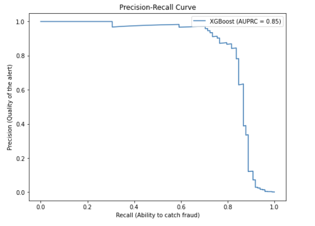

# 💳 Credit Card Fraud Detection System

## 📌 Project Overview
Fraud detection presents a significant challenge due to extreme class imbalance (legitimate transactions vastly outnumbering fraudulent ones). This project implements a robust machine learning pipeline to identify fraudulent activity with high precision, minimizing financial loss while maintaining a positive customer experience.

## 🛠️ Tech Stack
* **Language:** Python
* **Libraries:** Scikit-learn, XGBoost, Imbalanced-learn, Pandas, Matplotlib
* **Dataset:** Credit Card Fraud Detection (Kaggle)

## 🚀 Performance Result
The model achieved an **Area Under Precision-Recall Curve (AUPRC) of 0.85**, indicating strong performance in identifying the "needle in the haystack" without excessive false alarms.

## 🧠 Key Technical Implementations
* **Advanced Classifier:** Leveraged **XGBoost** for gradient boosting, specifically tuned for tabular financial data.
* **Imbalance Handling:** Utilized **SMOTE** (Synthetic Minority Over-sampling Technique) to balance the training set, allowing the model to learn fraud patterns effectively.
* **Evaluation Framework:** Focused on the **Precision-Recall Curve** rather than accuracy to accurately measure performance on minority class detection.
* **Feature Engineering:** Scaled transaction amounts and optimized feature selection to improve model convergence.
---
